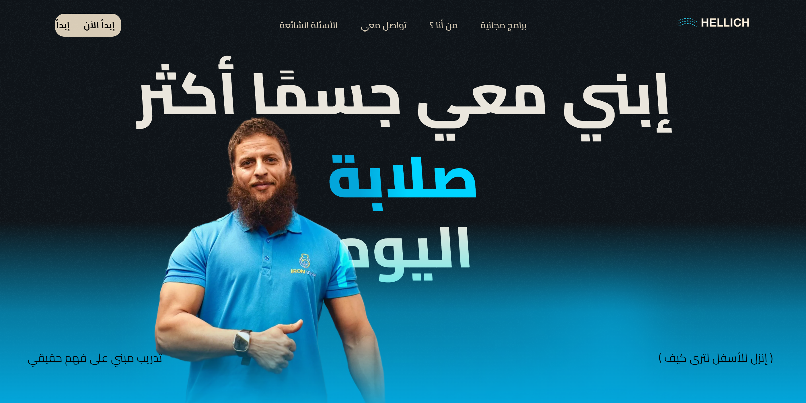
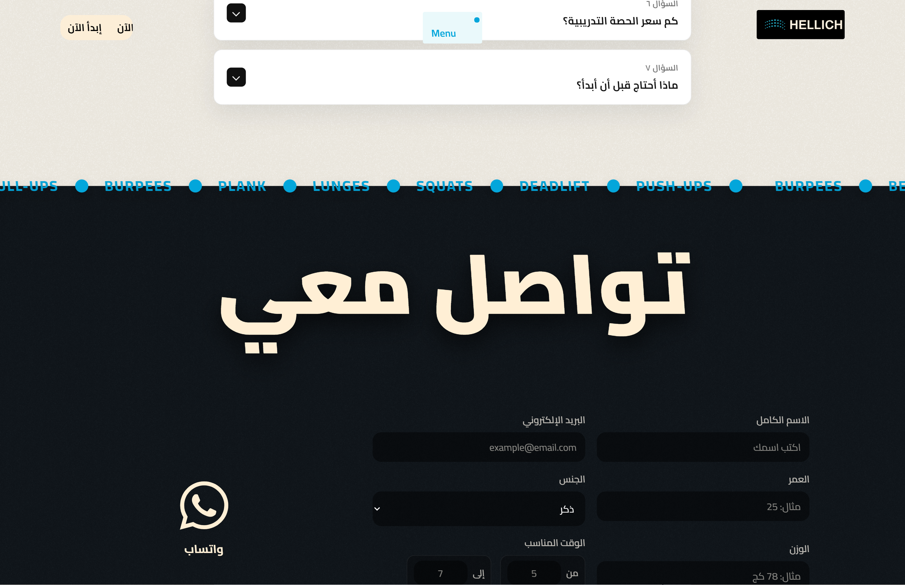
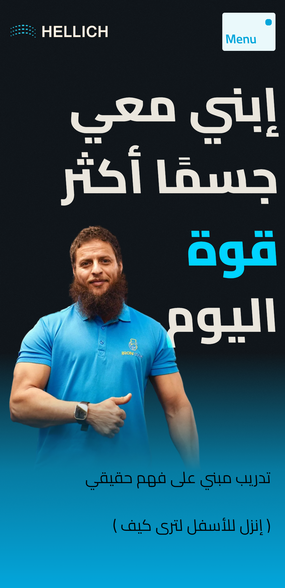
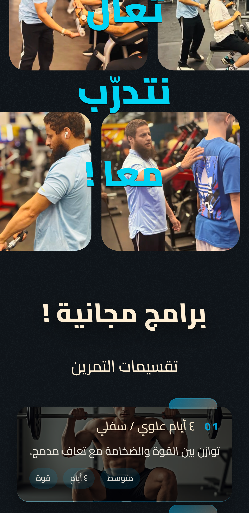

# Hellich

A high-performance personal trainer website crafted for impact, clarity, and conversion.

Built with a focus on motion, responsiveness, and Arabic-first user experience, this project blends modern frontend engineering with intentional UI design to deliver a premium digital presence for a fitness coach.

---

## Preview

### Desktop
  

### Mobile
  

---

## What Makes It Different

- **Motion-Driven Experience** — smooth, scroll-based interactions that guide attention
- **Arabic-First (RTL)** — designed from the ground up for native readability and flow
- **Responsive by Default** — consistent experience across all devices
- **Conversion-Focused Sections** — structured to turn visitors into clients
- **Clean UI System** — minimal, sharp, and purposeful design decisions

---

## Tech Stack

- React + TypeScript  
- Vite  
- Tailwind CSS  
- Serverless Functions (Netlify)

---

## Live Demo

[View Website](hellich.netlify.app)

---

## Note

The codebase is intentionally not documented for reuse.  
This repository exists to showcase execution, not to distribute implementation.

---